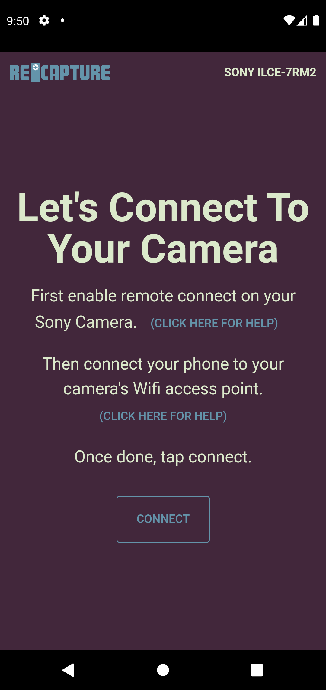

# Recapture


Remote camera software for select Sony Camera models
Uses Vue.js, Quasar, Capacitor, and Sony Camera SDK(beta, archived)

https://developer.sony.com/develop/cameras/

Sony has released their own desktop and mobile applications called Imaging Edge which make virtually all software developed using the api obsolete.

Regardless, this is my working example for Android.

You'll notice that features are limited. This is a result of the Sony Camera SDK and is also exibited in their own software. Not the least of which is the ability to focus on some cameras which render the SDK more or less useless.

## Install the dependencies

```bash
npm install
```

### Start the app in development mode (hot-code reloading, error reporting, etc.)

```bash
quasar dev -m capacitor -T android
```

### Lint the files

```bash
npm run lint
```

### Build the app for production

```bash
quasar build -m capacitor -T android
```

### Customize the configuration

See [Configuring quasar.conf.js](https://v2.quasar.dev/quasar-cli/quasar-conf-js).
